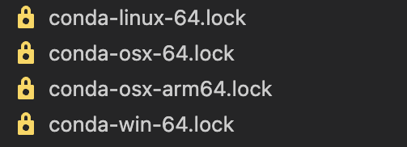

## Intro to Environments with Conda

### Introduction
In data science, we frequently rely on many packages. With Python, we commonly use libraries such as pandas, numpy, scikit-learn, and many others. However, these libraries are often compatible only with specific versions of each other. This is where Conda environments come into play.

### Why Use Conda Environments?
Conda environments allow us to list all the necessary packages for a project, along with their specific versions, in a single file. This way, when someone else wants to use our project, they can simply install all the required packages from this list, ensuring compatibility.

You might wonder: why do we need environments in the first place? Why can't we just install the packages directly?

The answer is simple: you may have multiple projects, each requiring a different set of packages. One project might need `Python 3.11`, while another requires `Python 3.9`. By using environments, you can maintain separate sets of installed packages and activate the appropriate set depending on the project you are working on.

In the next section, I will show you how to set up an environment file and install a conda environment from an environment file.

### Setting Up a Conda Environment

**Step 1: Installing Miniconda**
To get started, you need to install Miniconda, a lightweight version of Anaconda that provides just the essentials for managing Conda environments.

Follow the detailed instructions provided [here](https://docs.anaconda.com/miniconda/install/#quick-command-line-install) for installing Miniconda.

For a quick installation on macOS (ARM64), open your terminal and run the following commands:

```
mkdir -p ~/miniconda3
curl https://repo.anaconda.com/miniconda/Miniconda3-latest-MacOSX-arm64.sh -o ~/miniconda3/miniconda.sh
bash ~/miniconda3/miniconda.sh -b -u -p ~/miniconda3
rm ~/miniconda3/miniconda.sh
source ~/miniconda3/bin/activate
conda init --all
```

**Step 2: Creating the environment file**  
In your project folder, make the environment file named `environment.yaml`
Open the file and paste the following:

```yaml
name: tutorial
channels:
  - conda-forge
  - defaults
dependencies:
  - numpy=1.26.0
  - pandas=2.2.3
  - pip=24.3.1
  - python=3.11
  - scikit-learn=1.5.2
  - scipy=1.14.1
  - quarto=1.5.57
```

**Step 3: Creating the environemnt from environment.yaml**

While in the directory where the environemnt.yaml is locatied, run:  
```
conda env create -f environment.yaml
```

You can then activate the conda environment using:  
```  
conda activate tutorial
```


### Going One Step Further: Using Conda Lock Files
When you install an environment from an environment file, you might notice that additional packages, which were not explicitly listed, are also installed. For example, when we create the environment form our previous environment file, we see packages like xx installed:

Why does this happen? This occurs because in the environment file, we only specify high-level packages. 


But when installing a Conda environment across different operating systems, Conda may install different versions of these low-level packages. Consequently, even though the high-level packages remain the same, the overall environment may differ across platforms. Additionally, since we haven't specified exact versions for the low-level dependencies, installing the environment can take longer as Conda needs to resolve compatible versions on its own.

### The Solution? Conda Lock Files
Conda lock files are platform-specific files that list the exact versions of all dependency packages, including low-level ones, for a given environment. By using these lock files, you can ensure that the environment is identical across different platforms.

In the next section, I will demonstrate how to generate and use Conda lock files to create consistent environments across various operating systems.

### Generating and Using Conda Lock Files

Let’s assume we are working with the following environment file (`environment.yaml`):

```yaml
name: tutorial
channels:
  - conda-forge
  - defaults
dependencies:
  - numpy=1.26.0
  - pandas=2.2.3
  - pip=24.3.1
  - python=3.11
  - scikit-learn=1.5.2
  - scipy=1.14.1
  - quarto=1.5.57
```


To generate a lock file for different platforms, run the appropriate command below:


**For macOS (ARM-based, e.g., Apple Silicon):**  

```
conda-lock -k explicit -p osx_arm64 -f environment.yaml
```

**For macOS (intel):**  
```
conda-lock -k explicit -p osx-64 -f environment.yaml
```

**For Linux:**  
```
conda-lock -k explicit -p linux-64 -f environment.yaml
```

**For Windows:**      
```
conda-lock -k explicit -p win-64 -f environment.yaml
```

Assuming you are on macOS ARM, you can create an environment from the lock file by running:

```
conda-lock install --name tutorial conda-osx-arm64.lock
```

You should generate all four conda lock files to ensure your collaborators have the necessary files for their respective platforms. Running the four commands will produce the following files:



**Note:**  
- The --name flag specifies the environment name (tutorial in this case).
- The lock file ensures the exact versions of dependencies are installed, making the environment fully reproducible across different platforms.

### Conclusion
With this knowledge, you are now ready to collaborate effortlessly with others and ensure that your projects run smoothly on any system. Happy coding!
